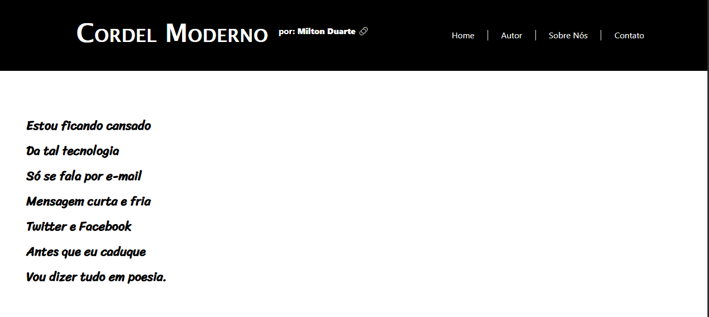

<h2 id="sobre-o-projeto">1. 🎤 Cordel Moderno: Um Poema Digital 🎤</h2>


[](https://github.com/Domisnnet/Modern-Cordel-Web-Essentials/blob/main/LICENSE)



Bem-vindo ao **Cordel Moderno**! Este repositório celebra a obra de **Milton Duarte**, unindo a tradição da literatura de cordel com a velocidade da era digital. Através de versos em septilhas (estrofes de sete versos), o projeto explora a nostalgia da comunicação antiga em contraste com a evolução tecnológica contemporânea.

---

## 📚 Tabela de Conteúdo

| 🎧 O Projeto | 🛠️ Técnico | 🤝 Comunidade |
| :---: | :---: | :---: |
| [](#sobre-o-projeto) | [](#destaques-tecnicos) | [](#codigo-fonte) |
| [](#tecnologias-utilizadas) | [](#instalacao) | [](#créditos) |
| [](#como-acessar) | [](#como-contribuir) | [](#licenca) |
| [](#funcionalidades) | [](#faq) | [](#perfil-do-github) |

---

<h2 id="tecnologias-utilizadas">2. ⚙️ Tecnologias Utilizadas</h2>

| Camada | Tecnologias | Descrição |
| :--- | :--- | :--- |
| **Frontend** |   | Estrutura semântica para a poesia e estilização personalizada. |
| **Framework UI** |  | Layout responsivo para leitura em qualquer dispositivo. |
| **Estética** |   | Iconografia que une o clássico ao tecnológico. |

---

<h2 id="como-acessar">3. 🚀 Como Acessar</h2>

Clique no botão abaixo para ler o Cordel Moderno diretamente no seu navegador:

<div align="left">
  <a href="https://domisnnet.github.io/Modern-Cordel-Web-Essentials/" target="_blank">
    
  </a>
</div>

---

<h2 id="funcionalidades">4. 🧩 Funcionalidades Principais</h2>

O projeto foca na legibilidade e na experiência poética digital:

| Funcionalidade | Descrição |
| :--- | :--- |
| 📖 **Poema Completo** | Exibição integral das septilhas de Milton Duarte. |
| 📱 **Leitura Adaptável** | Grid responsivo que garante o conforto visual em telas mobile. |
| 🎨 **Design Temático** | Estilização CSS que remete à textura e estética dos cordéis impressos. |
| 🔗 **Links Externos** | Conexão com a obra original no Recanto das Letras. |

---

<h2 id="destaques-tecnicos">5. 💻 Destaques Técnicos</h2>

Para criar esta ponte entre literatura e código, os desafios foram:

### 📐 Estruturação Poética
Uso de classes CSS específicas para manter a métrica das septilhas visível e organizada, respeitando o ritmo da leitura original do autor.

### 🖼️ Responsividade com Bootstrap
Implementação de containers flexíveis para que as imagens ilustrativas e o texto não percam o alinhamento, independente da resolução do usuário.

---

<h2 id="instalacao">6. 🚀 Instalação e Configuração Local</h2>

Deseja analisar a estrutura deste projeto cultural? Explore o repositório oficial:

```bash
# Clonar o repositório
git clone https://github.com/Domisnnet/Modern-Cordel-Web-Essentials.git(https://github.com/Domisnnet/Modern-Cordel-Web-Essentials.git)

# Acessar a pasta
cd Modern-Cordel-Web-Essentials
```

---

<h2 id="como-contribuir">7. 🤝 Como Contribuir</h2>

Siga os passos abaixo para fortalecer este projeto:

| Fase | Ação | Link / Comando |
| :---: | :--- | :--- |
| **01** | **Fork** | [](https://github.com/Domisnnet/Modern-Cordel-Web-Essentials/fork) |
| **02** | **Branch** | `git checkout -b feature/MinhaMelhoria` |
| **03** | **Commit** | `git commit -m 'feat: nova animação no texto'` |
| **04** | **Push** | `git push origin feature/MinhaMelhoria` |
| **05** | **PR** | [](https://github.com/Domisnnet/Modern-Cordel-Web-Essentials/compare)

### 🐛 Encontrou um problema?
Se algo não estiver funcionando como esperado, não hesite em abrir um chamado:

[](https://github.com/Domisnnet/Modern-Cordel-Web-Essentials/issues)
[](https://github.com/Domisnnet/Modern-Cordel-Web-Essentials/issues/new)

---

<h2 id="faq">8. 🧠 Perguntas Frequentes</h2>

<details>
<summary><strong>Quem é o autor do poema ❓</strong></summary>
<p>✍️ <strong>Resposta:</strong> O poema foi escrito por <strong>Milton Duarte</strong>, um mestre na arte do cordel, e está disponível também no Recanto das Letras.</p>
</details>

<details>
<summary><strong>O site possui recursos interativos ❓</strong></summary>
<p>⚡ <strong>Resposta:</strong> Atualmente o foco é na leitura e design. Futuras atualizações incluem elementos dinâmicos com JavaScript para tornar a navegação mais lúdica.</p>
</details>

<details>
<summary><strong>Posso sugerir melhorias no layout ❓</strong></summary>
<p>📩 <strong>Resposta:</strong> Com certeza! Adoramos receber feedbacks através de <strong>Issues</strong> no repositório.</p>
</details>

---

<h2 id="codigo-fonte">9. 💻 Código Fonte</h2>

Explore os arquivos de estilo e estrutura:


[](https://github.com/Domisnnet/Modern-Cordel-Web-Essentials)

---

<h2 id="créditos">10. 📝 Créditos & Reconhecimentos</h2>

O **Cordel Moderno** é uma união entre a poesia popular e o desenvolvimento web:

| Atribuição | Responsável / Recurso | Descrição |
| :--- | :--- | :--- |
| **Arquitetura & Dev** | **DomisDev** | Idealização, estruturação do código e design responsivo. |
| **Poesia Original** | **Milton Duarte** | Autor dos versos que compõem o conteúdo do projeto. |
| **Recursos Visuais** | **Font Awesome** | Fornecimento dos ícones que compõem a estética. |
| **Aprendizado** | **Comunidade Dev** | Baseado em princípios de UI/UX para leitura digital. |

### 🎯 Missão do Projeto
> "Este projeto foi construído para demonstrar que a tecnologia não apaga a tradição, mas serve como um novo palco para a literatura popular, democratizando o acesso à poesia através da web."

---

<h2 id="licenca">11. 📄 Licença</h2>

Este projeto está licenciado sob a [](https://github.com/Domisnnet/Modern-Cordel-Web-Essentials/blob/main/LICENSE)

---

<h2 id="perfil-do-github">12. 👨‍💻 Perfil do GitHub</h2>

<a href="https://github.com/Domisnnet"> 
   
</a>
